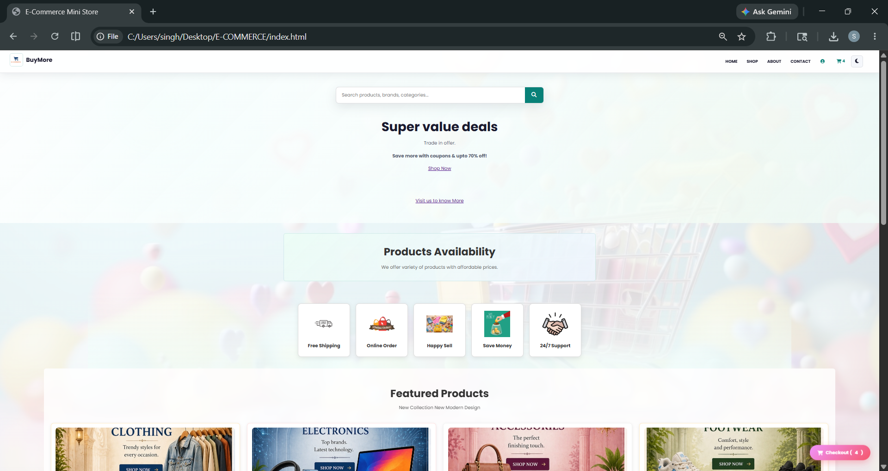
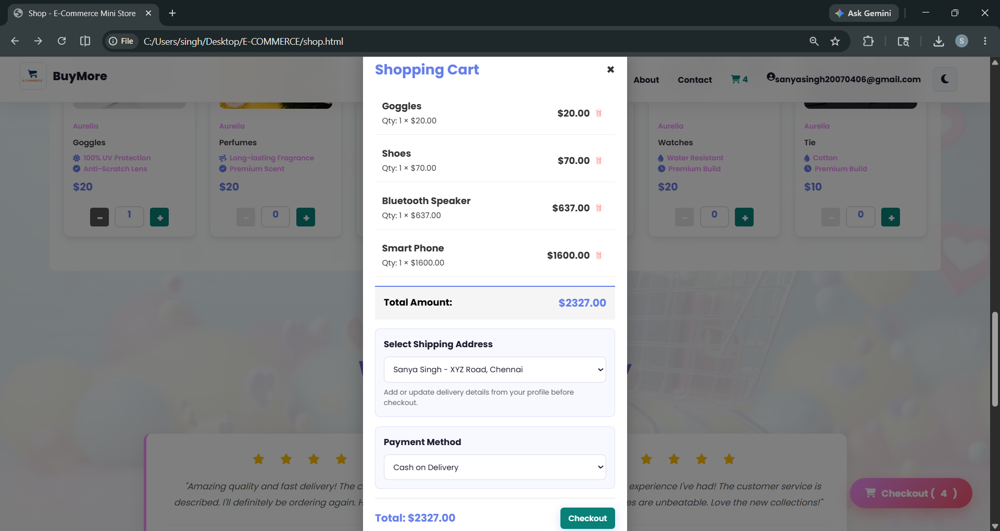
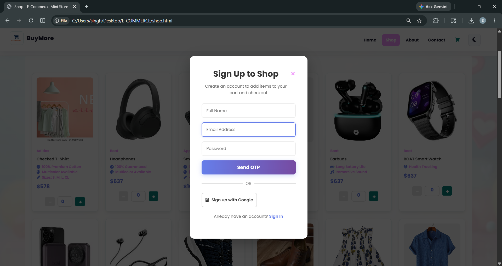

# E-Commerce Application

## Homepage


## Cart Page


## Login Page


## Deploy on Vercel + Render
This project is now structured for a simple Vercel frontend + Render backend deployment.

### Backend on Render
1. Push the project to GitHub.
2. Create a new Web Service on Render.
3. Set the Build Command to:
   ```bash
   pip install -r requirements.txt
   ```
4. Set the Start Command to:
   ```bash
   uvicorn app:app --host 0.0.0.0 --port $PORT
   ```
5. Add environment variables:
   - `ALLOWED_ORIGINS=https://your-vercel-app.vercel.app`

### Frontend on Vercel
1. Import the repository in Vercel.
2. Deploy it as a static site.
3. After deployment, update [config.js](config.js) with your Render backend URL:
   ```js
   window.__BACKEND_URL__ = 'https://your-render-app.onrender.com';
   ```

### Notes
- The frontend files are ready for Vercel hosting.
- The FastAPI backend in app.py can now run on Render.
- Full authentication, cart, wishlist, and order features will use the Render backend once the URL is configured.
